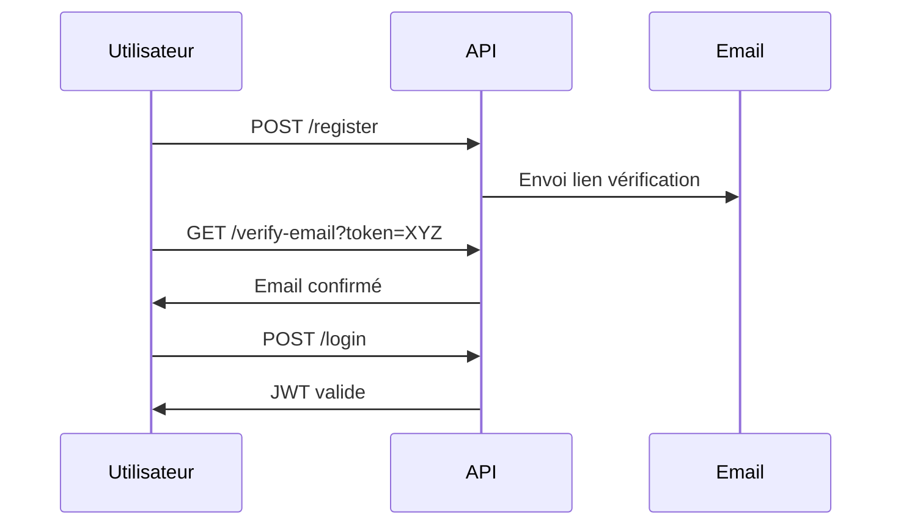

#  API Bibliothèque

Une API RESTful sécurisée pour la gestion de livres avec authentification JWT et vérification d'email.

##  Fonctionnalités

- **Gestion des livres** (CRUD complet)
- **Authentification utilisateur** avec JWT
- **Vérification d'email par lien**
- **Réinitialisation de mot de passe sécurisée**
- **Rôles utilisateur (admin/user)**
- **Validation des données robuste(express-validator)**
- **Documentation Swagger intégrée**
- **Sécurité renforcée (Helmet, CORS, rate limiting)**
- **Support SQLite pour le stockage**
- **Journalisation des activités (LOG_LEVEL configurable)**

##  Technologies

| Catégorie       | Technologies                          |
|-----------------|---------------------------------------|
| Backend         | Node.js 18+, Express 4.x             |
| Base de données | SQLite3 + Knex.js (migrations)       |
| Sécurité        | JWT, Bcrypt, Helmet, rate-limiter    |
| Email           | Nodemailer + SMTP (Gmail)            |
| Documentation   | Swagger UI + OpenAPI 3.0             |

##  Configuration

### Prérequis
- Node.js v16+
- npm
- Compte SMTP (Gmail recommandé pour le développement)

### Installation
1. Cloner le dépôt :
```bash
git clone https://github.com/nsconsult/API_BIBLIOTHEQUE.git
cd API_BIBLIOTHEQUE
```

2. Installer les dépendances :
```bash
npm install
npm install --save-dev nodemon # Pour le mode développement
```

3. Créer le fichier .env :
```bash
cp .env.example .env
```

4. Configurer les variables d'environnement :
```ini
# Copier ce fichier en .env et remplir les valeurs réelles

# Environnement d'exécution
NODE_ENV="développement"
PORT=3000
LOG_LEVEL="debug"

# URL de l'application frontale
FRONTEND_URL="http://localhost:3000"
DB_FILENAME="dev.sqlite3"
JWT_SECRET="clé_secrète_complexe_ici"

# Paramètres Gmail
SMTP_HOST="smtp.gmail.com"
SMTP_PORT=587
SMTP_SECURE=true

# Identifiants email
SMTP_USER="votre_email@gmail.com"
SMTP_PASSWORD="mot_de_passe_application_google"
EMAIL_FROM="Bibliothèque API <votre_email@gmail.com>"
```
> **Important** : Pour Gmail :  
> 🔐 Utilisez toujours un **[mot de passe d'application](https://myaccount.google.com/apppasswords)** plutôt que votre mot de passe principal.  
> ✅ Activez la [vérification en deux étapes](https://myaccount.google.com/security) si nécessaire.

5. Migrations de la base de données :
```bash
# Créer les tables dans la base de données
npm run migrate
```

6. Demarrer le serveur :
```bash
npm start # Production
npm run dev # Développement (avec rechargement automatique)
```
## Accès à la documentation

Après le démarrage du serveur :
🔗 [Documentation Swagger](http://localhost:3000/api-docs)

## Workflow d'authentification:


## Exemple de requête
Création d'un livre (nécessite JWT) :
```bash
curl -X POST http://localhost:3000/books \
  -H "Authorization: Bearer VOTRE_JWT" \
  -H "Content-Type: application/json" \
  -d '{
    "title": "1984",
    "author": "George Orwell",
    "publicationDate": "1949-06-08",
    "genre": "Dystopie",
    "pageCount": 328
  }'
```

## Sécurité renforcée

- **JWT Config** :
  - Secret complexe (32+ caractères)
  - Expiration : 1 heure
  - Algorithme : HS256
  
- **Protections** :
  - Rate limiting (100 req/15min)
  - Headers de sécurité (Helmet)
  - CORS restreint
  - Validation stricte des inputs

## Licence
Ce projet est sous licence [MIT](LICENSE).

---

**Développé avec ❤️ par [Nazim ALI]** - [Contact](mailto:nazim.ali@epitech.eu) | [Issues](https://github.com/nsconsult/API_BIBLIOTHEQUE/issues)


